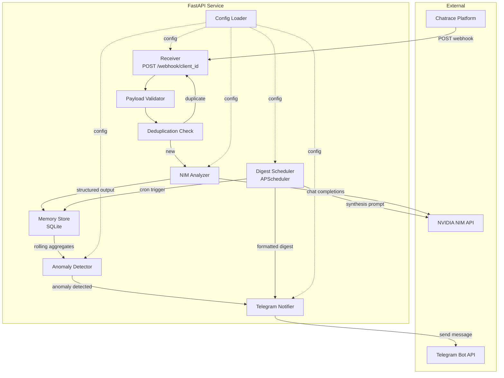
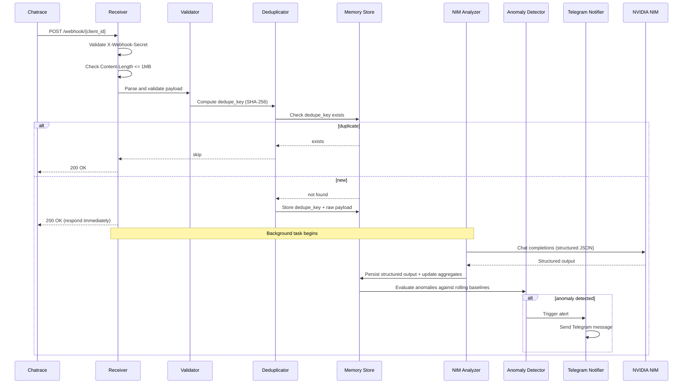
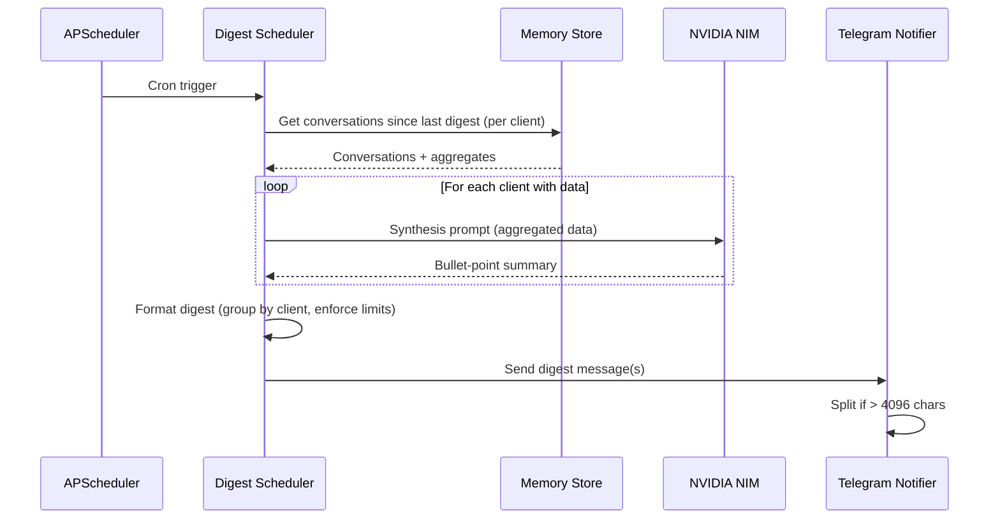
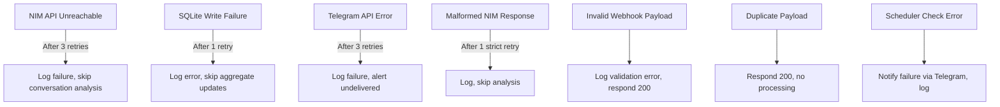

# Design Document: Conversation Intelligence Monitor

## Overview

The Conversation Intelligence Monitor is a FastAPI service that operates as a real-time pipeline:

1. **Receive** — Accept webhook POSTs from Chatrace containing completed WhatsApp conversation transcripts
2. **Validate & Deduplicate** — Ensure payload integrity and prevent reprocessing
3. **Analyze** — Extract structured insights (outcome, sentiment, errors) via NVIDIA NIM chat completions API
4. **Persist** — Store raw payloads, structured outputs, and rolling aggregates in SQLite
5. **Detect** — Compare per-conversation metrics against rolling baselines to identify anomalies
6. **Alert** — Deliver real-time Telegram alerts for anomalies and periodic digest summaries

The service supports multiple clients/bots, each with independent thresholds, active-hours definitions, and digest schedules.

### Key Design Decisions

| Decision | Rationale |
|----------|-----------|
| SQLite over PostgreSQL | Single-node deployment, low ops burden, sufficient for expected throughput (~thousands of conversations/day) |
| Background task for analysis | Respond 200 immediately to Chatrace; analysis runs async via FastAPI BackgroundTasks |
| APScheduler in-process | Avoid external cron/job infrastructure; single process simplicity |
| NVIDIA NIM (OpenAI-compatible) | Structured JSON extraction with retry/fallback; model name configurable |
| Pydantic for validation | Strong typing for payloads, structured outputs, and config |
| httpx async client | Non-blocking HTTP calls to NIM and Telegram APIs |
| aiosqlite | Async SQLite access compatible with FastAPI's async runtime |

## Architecture



### Request Flow Sequence



### Digest Generation Sequence



## Components and Interfaces

### Module Layout

```
chatbot_monitor/
├── __init__.py
├── main.py                  # FastAPI app factory, lifespan events
├── config.py                # Config loading (YAML + env vars)
├── receiver.py              # Webhook endpoint, header validation
├── validator.py             # Payload schema validation, truncation
├── deduplicator.py          # Dedupe key computation and lookup
├── nim_analyzer.py          # NIM API client, prompt templates, retry
├── memory_store.py          # SQLite DAL (data access layer)
├── anomaly_detector.py      # Threshold checks, cooldown, persistence count
├── digest_scheduler.py      # APScheduler jobs, synthesis prompt
├── telegram_notifier.py     # Telegram Bot API client, message formatting
├── models.py                # Pydantic models (payload, structured output, config)
└── prompts/
    ├── analysis.txt         # NIM analysis prompt template
    ├── analysis_strict.txt  # Stricter retry prompt
    └── digest.txt           # NIM digest synthesis prompt
```

### Public Interfaces

#### config.py

```python
@dataclass
class ClientConfig:
    client_id: str
    display_name: str
    thresholds: AlertThresholds
    active_hours: ActiveHours | None

@dataclass
class AppConfig:
    webhook_secret: str
    nim_api_key: str
    nim_base_url: str
    nim_model: str
    telegram_bot_token: str
    telegram_chat_id: str
    digest_schedule: str           # cron expression
    alert_defaults: AlertThresholds
    clients: dict[str, ClientConfig]
    db_path: str

def load_config(yaml_path: str = "config.yaml") -> AppConfig:
    """Load config from YAML + env overrides. Raises on missing required values."""
```

#### receiver.py

```python
async def webhook_endpoint(
    client_id: str,
    request: Request,
    background_tasks: BackgroundTasks,
    config: AppConfig = Depends(get_config),
    store: MemoryStore = Depends(get_store),
) -> Response:
    """POST /webhook/{client_id} - validates secret, stores raw, enqueues analysis."""
```

#### validator.py

```python
def validate_payload(client_id: str, body: dict) -> ValidatedPayload:
    """Validate required fields, truncate chat_history, compute dedupe_key.
    Raises ValidationError on invalid payload."""

def compute_dedupe_key(client_id: str, contact_id: str, timestamp: str) -> str:
    """SHA-256 hash of client_id + contact_id + timestamp (normalized to second precision)."""

def truncate_chat_history(messages: list[dict], max_messages: int = 50) -> list[dict]:
    """Return the last `max_messages` messages from the list."""
```

#### nim_analyzer.py

```python
class NIMAnalyzer:
    def __init__(self, config: AppConfig, http_client: httpx.AsyncClient):
        ...

    async def analyze(
        self, chat_history: list[dict], client_id: str, dedupe_key: str
    ) -> StructuredOutput | None:
        """Send chat_history to NIM, return structured output or None on failure.
        Retries: malformed → 1x stricter prompt; timeout/error → 3x exponential backoff."""
```

#### memory_store.py

```python
class MemoryStore:
    def __init__(self, db_path: str):
        ...

    async def initialize(self) -> None:
        """Create tables and indices if not present. Enable WAL mode."""

    async def has_dedupe_key(self, key: str) -> bool: ...
    async def store_dedupe_key(self, key: str, client_id: str) -> None: ...
    async def store_raw_payload(self, client_id: str, dedupe_key: str, payload: dict) -> None: ...
    async def store_structured_output(
        self, client_id: str, contact_id: str, dedupe_key: str,
        timestamp: str, output: StructuredOutput
    ) -> None:
        """Persist output and update rolling aggregates in one transaction."""

    async def get_rolling_aggregates(self, client_id: str) -> RollingAggregates: ...
    async def get_conversations_since(self, client_id: str, since: datetime) -> list[StructuredOutput]: ...
    async def get_last_conversation_time(self, client_id: str) -> datetime | None: ...
    async def is_in_cooldown(self, client_id: str, issue_type: str, stage: str | None, cooldown_minutes: int) -> bool: ...
    async def record_flag(self, client_id: str, issue_type: str, stage: str | None, metric: float, baseline: float) -> None: ...
    async def purge_old_records(self, days: int = 90) -> int: ...
```

#### anomaly_detector.py

```python
class AnomalyDetector:
    def __init__(self, config: AppConfig, store: MemoryStore, notifier: TelegramNotifier):
        ...

    async def evaluate(self, client_id: str, output: StructuredOutput) -> list[AnomalyAlert]:
        """Check a new conversation against rolling baselines. Return triggered alerts."""

    async def check_inactive_clients(self) -> None:
        """Scheduled job: check for clients with zero conversations during active hours."""

    def is_within_active_hours(self, active_hours: ActiveHours, dt: datetime) -> bool:
        """Pure function: determine if datetime falls within active hours window."""
```

#### digest_scheduler.py

```python
class DigestScheduler:
    def __init__(
        self, config: AppConfig, store: MemoryStore,
        analyzer: NIMAnalyzer, notifier: TelegramNotifier
    ):
        ...

    def start(self) -> None:
        """Register APScheduler jobs (digest + inactive-hours check)."""

    async def generate_digest(self) -> None:
        """Retrieve data per client, call NIM synthesis, format, deliver via Telegram."""
```

#### telegram_notifier.py

```python
class TelegramNotifier:
    def __init__(self, bot_token: str, chat_id: str, http_client: httpx.AsyncClient):
        ...

    async def send_alert(self, alert: AnomalyAlert) -> bool:
        """Send 🚨-prefixed alert. Truncates to 4096 chars. Retries 3x. Returns success."""

    async def send_digest(self, digest: DigestMessage) -> bool:
        """Send 📊-prefixed digest. Splits if >4096. Retries 3x. Returns success."""

    def format_alert_message(self, alert: AnomalyAlert) -> str:
        """Format alert with emoji prefix, truncate if needed."""

    def format_digest_messages(self, digest: DigestMessage) -> list[str]:
        """Format and split digest into <=4096 char messages."""
```

#### main.py (Application Entry Point)

```python
from contextlib import asynccontextmanager

@asynccontextmanager
async def lifespan(app: FastAPI):
    # Startup: load config, init store, create components
    config = load_config()
    store = MemoryStore(config.db_path)
    await store.initialize()
    http_client = httpx.AsyncClient()
    analyzer = NIMAnalyzer(config, http_client)
    notifier = TelegramNotifier(config.telegram_bot_token, config.telegram_chat_id, http_client)
    detector = AnomalyDetector(config, store, notifier)
    scheduler = DigestScheduler(config, store, analyzer, notifier)
    scheduler.start()
    # Inject into app state
    app.state.config = config
    app.state.store = store
    app.state.analyzer = analyzer
    app.state.detector = detector
    yield
    # Shutdown
    scheduler.shutdown()
    await http_client.aclose()

app = FastAPI(lifespan=lifespan)
app.include_router(receiver_router)
```

## Data Models

### Pydantic Models

```python
from pydantic import BaseModel, Field
from typing import Literal, Optional
from datetime import datetime
from enum import Enum

class Outcome(str, Enum):
    QUALIFIED_LEAD = "qualified_lead"
    NOT_INTERESTED = "not_interested"
    DROPPED_OFF = "dropped_off"
    BOOKED = "booked"
    SPAM = "spam"
    UNCLEAR = "unclear"

class DropOffStage(str, Enum):
    GREETING = "greeting"
    QUALIFICATION = "qualification"
    OBJECTION_HANDLING = "objection_handling"
    CLOSING = "closing"

class Sentiment(str, Enum):
    POSITIVE = "positive"
    NEUTRAL = "neutral"
    FRUSTRATED = "frustrated"
    NEGATIVE = "negative"

class ChatMessage(BaseModel):
    role: str
    content: str
    timestamp: Optional[str] = None

class WebhookPayload(BaseModel):
    """Validated incoming webhook payload."""
    contact_id: str
    timestamp: str  # ISO 8601
    chat_history: list[ChatMessage]
    tags: Optional[list[str]] = None
    last_ref: Optional[str] = None
    user_source: Optional[str] = None

class StructuredOutput(BaseModel):
    """NIM analysis result for a single conversation."""
    outcome: Outcome
    drop_off_stage: Optional[DropOffStage] = None
    sentiment: Sentiment
    bot_error_detected: bool
    bot_error_notes: Optional[str] = Field(None, max_length=500)
    notable_quote: Optional[str] = Field(None, max_length=300)
    summary: str = Field(..., max_length=200)

class AlertThresholds(BaseModel):
    """Per-client or default alert configuration."""
    dropoff_rate_pct: float = 50.0
    low_volume_pct: float = 50.0
    consecutive_errors: int = 3
    consecutive_neg_sentiment: int = 3
    persistence_count: int = Field(default=3, ge=1, le=50)
    cooldown_minutes: int = 60

class ActiveHours(BaseModel):
    """Per-client active hours definition."""
    start_time: str   # HH:MM 24h format
    end_time: str     # HH:MM 24h format
    timezone: str     # e.g. "America/Sao_Paulo"
    days: list[int]   # 0=Monday..6=Sunday

class AnomalyAlert(BaseModel):
    """A detected anomaly ready for notification."""
    client_id: str
    client_display_name: str
    issue_type: str  # "high_dropoff" | "consecutive_errors" | "low_volume" | "negative_sentiment" | "inactive_hours"
    stage: Optional[str] = None
    metric_value: float
    baseline_value: float
    message: str

class DigestSection(BaseModel):
    """One client's section in a digest."""
    client_id: str
    client_display_name: str
    bullets: list[str]  # max 10 items, max 280 chars each

class DigestMessage(BaseModel):
    """Complete digest with all client sections."""
    sections: list[DigestSection]
    generated_at: datetime

class RollingAggregates(BaseModel):
    """Computed rolling statistics for a client."""
    daily_volume_7d: list[int]
    daily_volume_30d: list[int]
    outcome_dist_7d: dict[str, int]
    outcome_dist_30d: dict[str, int]
    dropoff_by_stage_7d: dict[str, int]
    dropoff_by_stage_30d: dict[str, int]
    sentiment_dist_7d: dict[str, int]
    sentiment_dist_30d: dict[str, int]
    recent_errors: list[bool]       # last N bot_error_detected values
    recent_sentiments: list[str]    # last N sentiment values
    total_conversations_7d: int
    total_conversations_30d: int
```

### SQLite Schema

```sql
PRAGMA journal_mode=WAL;
PRAGMA foreign_keys=ON;

CREATE TABLE IF NOT EXISTS dedupe_keys (
    key TEXT PRIMARY KEY,
    client_id TEXT NOT NULL,
    created_at TEXT NOT NULL DEFAULT (strftime('%Y-%m-%dT%H:%M:%SZ', 'now'))
);

CREATE TABLE IF NOT EXISTS raw_payloads (
    id INTEGER PRIMARY KEY AUTOINCREMENT,
    dedupe_key TEXT UNIQUE NOT NULL,
    client_id TEXT NOT NULL,
    contact_id TEXT NOT NULL,
    timestamp TEXT NOT NULL,
    payload_json TEXT NOT NULL,
    received_at TEXT NOT NULL DEFAULT (strftime('%Y-%m-%dT%H:%M:%SZ', 'now')),
    FOREIGN KEY (dedupe_key) REFERENCES dedupe_keys(key)
);

CREATE TABLE IF NOT EXISTS structured_outputs (
    id INTEGER PRIMARY KEY AUTOINCREMENT,
    dedupe_key TEXT UNIQUE NOT NULL,
    client_id TEXT NOT NULL,
    contact_id TEXT NOT NULL,
    timestamp TEXT NOT NULL,
    outcome TEXT NOT NULL,
    drop_off_stage TEXT,
    sentiment TEXT NOT NULL,
    bot_error_detected INTEGER NOT NULL DEFAULT 0,
    bot_error_notes TEXT,
    notable_quote TEXT,
    summary TEXT NOT NULL,
    analyzed_at TEXT NOT NULL DEFAULT (strftime('%Y-%m-%dT%H:%M:%SZ', 'now')),
    FOREIGN KEY (dedupe_key) REFERENCES dedupe_keys(key)
);

CREATE TABLE IF NOT EXISTS flag_history (
    id INTEGER PRIMARY KEY AUTOINCREMENT,
    client_id TEXT NOT NULL,
    issue_type TEXT NOT NULL,
    stage TEXT,
    metric_value REAL,
    baseline_value REAL,
    triggered_at TEXT NOT NULL DEFAULT (strftime('%Y-%m-%dT%H:%M:%SZ', 'now')),
    cooldown_until TEXT NOT NULL
);

CREATE TABLE IF NOT EXISTS digest_log (
    id INTEGER PRIMARY KEY AUTOINCREMENT,
    generated_at TEXT NOT NULL DEFAULT (strftime('%Y-%m-%dT%H:%M:%SZ', 'now')),
    client_ids TEXT NOT NULL,
    synthesis_text TEXT,
    delivered INTEGER NOT NULL DEFAULT 0
);

-- Performance indices
CREATE INDEX IF NOT EXISTS idx_structured_client_ts ON structured_outputs(client_id, timestamp);
CREATE INDEX IF NOT EXISTS idx_structured_client_outcome ON structured_outputs(client_id, outcome);
CREATE INDEX IF NOT EXISTS idx_raw_client_ts ON raw_payloads(client_id, timestamp);
CREATE INDEX IF NOT EXISTS idx_flag_cooldown ON flag_history(client_id, issue_type, stage, cooldown_until);
CREATE INDEX IF NOT EXISTS idx_dedupe_created ON dedupe_keys(created_at);
```

### Rolling Aggregate Computation

Aggregates are computed on-demand via SQL queries rather than stored as materialized rows. This avoids staleness and simplifies the schema:

```sql
-- 7-day daily volume for a client
SELECT DATE(timestamp) as day, COUNT(*) as count
FROM structured_outputs
WHERE client_id = ? AND timestamp >= datetime('now', '-7 days')
GROUP BY DATE(timestamp);

-- Outcome distribution (7-day)
SELECT outcome, COUNT(*) as count
FROM structured_outputs
WHERE client_id = ? AND timestamp >= datetime('now', '-7 days')
GROUP BY outcome;

-- Recent N conversations for consecutive-anomaly checks
SELECT bot_error_detected, sentiment
FROM structured_outputs
WHERE client_id = ?
ORDER BY timestamp DESC
LIMIT ?;
```

### Configuration File Structure

```yaml
# config.yaml
webhook_secret: "${WEBHOOK_SECRET}"

nim:
  api_key: "${NIM_API_KEY}"
  base_url: "https://integrate.api.nvidia.com/v1"
  model: "meta/llama-3.1-70b-instruct"
  timeout_seconds: 30

telegram:
  bot_token: "${TELEGRAM_BOT_TOKEN}"
  chat_id: "${TELEGRAM_CHAT_ID}"

digest:
  schedule: "0 8 * * *"  # daily at 08:00 UTC

inactive_check_interval_minutes: 60
db_path: "data/monitor.db"
log_level: "INFO"

alert_defaults:
  dropoff_rate_pct: 50
  low_volume_pct: 50
  consecutive_errors: 3
  consecutive_neg_sentiment: 3
  persistence_count: 3
  cooldown_minutes: 60

clients:
  - client_id: "bot_realestate"
    display_name: "Real Estate Bot"
    active_hours:
      start_time: "08:00"
      end_time: "22:00"
      timezone: "America/Sao_Paulo"
      days: [0, 1, 2, 3, 4]
    thresholds:
      dropoff_rate_pct: 40
      cooldown_minutes: 90

  - client_id: "bot_insurance"
    display_name: "Insurance Bot"
    active_hours:
      start_time: "09:00"
      end_time: "18:00"
      timezone: "America/Sao_Paulo"
      days: [0, 1, 2, 3, 4, 5]
    thresholds: {}  # uses alert_defaults
```


## Correctness Properties

*A property is a characteristic or behavior that should hold true across all valid executions of a system — essentially, a formal statement about what the system should do. Properties serve as the bridge between human-readable specifications and machine-verifiable correctness guarantees.*

### Property 1: Webhook Authentication

*For any* HTTP request to `/webhook/{client_id}`, the receiver SHALL return HTTP 401 if and only if the `X-Webhook-Secret` header is missing or does not exactly match the configured shared secret.

**Validates: Requirements 1.2, 1.3**

### Property 2: Unknown Client Rejection

*For any* client_id string not present in the configured clients list, a POST to `/webhook/{client_id}` with a valid secret SHALL respond with HTTP 404.

**Validates: Requirements 1.4**

### Property 3: Payload Required Field Validation

*For any* JSON payload, the validator SHALL accept it for processing if and only if it contains all three required fields (`chat_history`, `contact_id`, `timestamp`) where `chat_history` is a non-empty list and `timestamp` is valid ISO 8601. Payloads missing any required field or with invalid format SHALL be rejected.

**Validates: Requirements 2.1, 2.2, 2.3, 2.5**

### Property 4: Chat History Truncation Invariant

*For any* chat_history with N messages: if N ≤ 50, the validated output SHALL have length N with identical content in original order; if N > 50, the validated output SHALL have exactly 50 messages equal to the last 50 entries of the original in their original order.

**Validates: Requirements 2.4**

### Property 5: Dedupe Key Determinism

*For any* triple of (client_id, contact_id, timestamp), the computed dedupe_key SHALL equal `SHA-256(client_id + contact_id + timestamp_normalized_to_second_precision)` and SHALL produce identical results on repeated computations with the same inputs. Two timestamps differing only in sub-second precision SHALL produce the same dedupe_key.

**Validates: Requirements 3.1**

### Property 6: Idempotent Processing

*For any* valid webhook payload processed N times (N ≥ 2) with the same client_id, contact_id, and timestamp, the system SHALL create exactly one record in structured_outputs and store the dedupe_key exactly once.

**Validates: Requirements 3.3**

### Property 7: Structured Output Parsing Round-Trip

*For any* valid StructuredOutput object, serializing it to the JSON schema expected from NIM and then parsing it through the analyzer's response parser SHALL produce an equivalent StructuredOutput with all field values preserved.

**Validates: Requirements 4.2**

### Property 8: Structured Output Persistence Round-Trip

*For any* valid StructuredOutput persisted via Memory_Store with given metadata (client_id, contact_id, dedupe_key, timestamp), retrieving the record by dedupe_key SHALL return a record with identical field values for all StructuredOutput fields.

**Validates: Requirements 5.1**

### Property 9: Rolling Aggregate Correctness

*For any* set of StructuredOutput records for a given client_id within the last 7 days, the rolling aggregates SHALL report: daily_volume whose sum equals the total record count, outcome_dist whose values sum to the total count, sentiment_dist whose values sum to the total count, and dropoff_by_stage whose values sum to the count of records with outcome="dropped_off".

**Validates: Requirements 5.3**

### Property 10: Anomaly Detection Threshold Logic

*For any* combination of current conversation metrics, rolling aggregate baselines, and configured thresholds, the Anomaly Detector SHALL trigger an alert if and only if: (a) a threshold condition is met (e.g., drop-off rate exceeds baseline by configured percentage), AND (b) the condition has persisted for at least `persistence_count` consecutive qualifying events, AND (c) the (client_id, issue_type, stage) combination is not within its cooldown window.

**Validates: Requirements 6.2, 6.3, 6.4, 6.5**

### Property 11: Cooldown Suppression

*For any* anomaly triggered at time T with cooldown of C minutes, any subsequent anomaly of the same type for the same client_id and stage SHALL be suppressed if triggered before T + C minutes, and SHALL be allowed if triggered at or after T + C minutes.

**Validates: Requirements 6.4**

### Property 12: Inactive Hours Detection

*For any* client with configured active hours (start_time, end_time, timezone, days), and a check time T: if T falls within the active window on an applicable day AND the client has zero conversations since the start of that window, an alert SHALL be produced. If the client has at least one conversation in the window OR T is outside active hours OR the day is not applicable, no alert SHALL be produced. Clients without active_hours SHALL be skipped entirely.

**Validates: Requirements 7.2, 7.3, 7.4**

### Property 13: Alert Message Formatting and Truncation

*For any* AnomalyAlert object, the formatted Telegram message SHALL: (a) start with the 🚨 prefix, (b) contain the issue_type, client_display_name, metric_value, and baseline_value as substrings, and (c) have total length ≤ 4096 characters. If the untruncated message exceeds 4096 characters, truncation SHALL preserve the prefix, issue_type, and client_display_name.

**Validates: Requirements 9.1, 9.2, 9.4**

### Property 14: Digest Message Formatting and Splitting

*For any* DigestMessage with one or more sections, the formatted output SHALL: (a) start the first message with 📊, (b) include one labeled section per client using their display_name, (c) contain at most 10 bullets per client section with each bullet at most 280 characters, and (d) if the total exceeds 4096 characters, be split into multiple messages each ≤ 4096 characters with all bullet content preserved across the split.

**Validates: Requirements 8.4, 10.1, 10.2, 10.3, 10.4**

### Property 15: Configuration Environment Variable Precedence

*For any* configuration key present in both config.yaml and an environment variable, the loaded configuration SHALL use the environment variable value.

**Validates: Requirements 11.1**

### Property 16: Configuration Completeness Validation

*For any* configuration missing one or more required global keys (webhook_secret, nim api_key, nim base_url, nim model, telegram bot_token, telegram chat_id, digest schedule) OR containing a per-client entry missing required fields (client_id, display_name), the `load_config()` function SHALL raise a validation error and refuse to produce an AppConfig.

**Validates: Requirements 11.3, 11.4, 11.6**

### Property 17: Structured Log Output Format

*For any* log event emitted by the system, the output on stdout SHALL be valid JSON containing at minimum: an ISO 8601 `timestamp` field, a `level` field, a `module` field, and a `message` field. Any individual field value exceeding 10,000 characters SHALL be truncated.

**Validates: Requirements 12.2, 12.5**

## Error Handling

### Retry Strategy Summary

| Module | Failure Type | Strategy | Max Attempts | Backoff |
|--------|-------------|----------|--------------|---------|
| NIM Analyzer | Malformed JSON response | Retry with stricter prompt | 2 (initial + 1) | Immediate |
| NIM Analyzer | Timeout / HTTP error | Exponential backoff | 3 | 2s → 4s → 8s |
| Memory Store | Write failure | Simple retry | 2 (initial + 1) | Immediate |
| Telegram Notifier | API error | Exponential backoff | 3 | 2s → 4s → 8s |
| Digest Scheduler | NIM failure | Skip, retry next cycle | 1 per cycle | N/A |
| Digest Scheduler | Telegram failure | Retry next cycle (cache synthesis) | 1 per cycle | N/A |

### Failure Isolation



### Error Propagation Rules

1. **Webhook response is never blocked** — The receiver responds HTTP 200 immediately after storing the raw payload and dedupe key. All downstream failures (NIM, anomaly detection, Telegram) happen in background tasks and never affect the HTTP response.
2. **Conversation isolation** — Errors in one conversation's processing NEVER affect other conversations.
3. **Data-first** — Data is persisted to SQLite BEFORE external calls (Telegram). No data loss from delivery failures.
4. **Scheduler self-healing** — Failed digest/inactive-check cycles automatically retry on the next scheduled interval.

### Graceful Degradation

- **NIM unavailable:** Conversations are stored raw; analysis is skipped. Can be retried in future enhancement.
- **Telegram unavailable:** Alerts are logged to stdout with full anomaly details. Digest synthesis is cached for retry on next interval.
- **SQLite disk full:** Process logs CRITICAL error and continues accepting webhooks (responding 200) but skips storage.
- **Config errors at startup:** Process refuses to start with clear error message identifying the issue.

## Testing Strategy

### Dual Testing Approach

This feature is well-suited to property-based testing for its pure validation, computation, and formatting logic, combined with example-based tests for integration points and error paths.

**Property-Based Tests (using `hypothesis`):**
- Each correctness property (1–17) maps to one property-based test
- Minimum 100 iterations per property test
- Tag format: `# Feature: chatbot-monitor, Property {N}: {title}`
- Focus: validation logic, deduplication, formatting, anomaly detection, config loading

**Example-Based Unit Tests (using `pytest`):**
- NIM retry behavior (malformed response → stricter prompt → success/failure)
- Telegram retry timing (exponential backoff verification)
- Edge cases: empty chat_history, 1MB payload boundary, malformed YAML config
- Error paths: all retry-exhaustion scenarios
- Logging verification: correct fields at correct log levels

**Integration Tests:**
- Full webhook-to-alert flow with mocked NIM and Telegram (httpx mocks)
- Digest generation cycle end-to-end
- Database retention/purge logic with time manipulation
- APScheduler job registration and trigger verification
- Inactive hours alert generation

### Property-Based Testing Configuration

- **Library:** `hypothesis` (Python PBT standard)
- **Settings:** `@settings(max_examples=100)` minimum per property
- **Custom strategies:**
  - `st_structured_output()` — valid `StructuredOutput` instances
  - `st_webhook_payload()` — valid/invalid webhook payloads
  - `st_anomaly_alert()` — `AnomalyAlert` objects with random values
  - `st_client_config()` — client configurations with thresholds
  - `st_rolling_aggregates()` — consistent aggregate data
  - `st_chat_history(n)` — chat histories of configurable length
- **CI determinism:** `@settings(derandomize=True)` for reproducible failures

### Test Fixtures

```python
# conftest.py
@pytest.fixture
async def memory_store():
    """In-memory SQLite store for fast isolated tests."""
    store = MemoryStore(":memory:")
    await store.initialize()
    yield store

@pytest.fixture
def mock_nim(httpx_mock):
    """Mock NIM API responses (success, malformed, timeout)."""

@pytest.fixture
def mock_telegram(httpx_mock):
    """Mock Telegram Bot API responses."""

@pytest.fixture
def app_config():
    """Valid AppConfig with two test clients."""

@pytest.fixture
def test_app(app_config, memory_store):
    """FastAPI TestClient with injected dependencies."""
```

### Coverage Matrix

| Module | Property Tests | Unit Tests | Integration Tests |
|--------|---------------|------------|-------------------|
| Config Loader | P15, P16 | Malformed YAML, env edge cases | Startup smoke |
| Receiver | P1, P2 | Size limit, header edge cases | Full webhook flow |
| Validator | P3, P4, P5 | Empty fields, boundary cases | — |
| Deduplicator | P5, P6 | Timestamp normalization | Concurrent submissions |
| NIM Analyzer | P7 | Retry logic, timeout handling | Mock API sequences |
| Memory Store | P8, P9 | Write failure, purge logic | Retention lifecycle |
| Anomaly Detector | P10, P11, P12 | Insufficient data, threshold boundary | Alert delivery chain |
| Telegram Notifier | P13, P14 | Retry exhaustion, split edge cases | Mock delivery |
| Digest Scheduler | — | NIM failure, Telegram failure | Full digest cycle |
| Logging | P17 | Truncation, contact_id tracing | — |
